# Documentação Técnica do Banco de Dados

## Plataforma SaaS Imobiliária Multi-tenant

Versão: 1.0  
Última atualização: Janeiro 2026

---

## Índice

1. [Visão Geral](#visão-geral)
2. [Diagrama ER](#diagrama-er)
3. [Enums](#enums)
4. [Tabelas](#tabelas)
5. [Funções](#funções)
6. [Políticas RLS](#políticas-rls)
7. [Storage](#storage)

---

## Visão Geral

Este banco de dados suporta uma plataforma SaaS multi-tenant para gestão imobiliária, incluindo:

- **Multi-tenancy**: Isolamento completo de dados entre empresas
- **White-label**: Suporte a domínios personalizados por tenant
- **RBAC**: Sistema de papéis e permissões granular
- **Portal Integration**: Integração com portais imobiliários (ZAP, OLX, VivaReal, etc.)
- **Subscription Management**: Gestão de planos e assinaturas

### Stack Tecnológica

- **Database**: PostgreSQL 15+ (Supabase)
- **Auth**: Supabase Auth
- **Storage**: Supabase Storage
- **RLS**: Row Level Security habilitado em todas as tabelas

---

## Diagrama ER

```mermaid
erDiagram
    %% ========================================
    %% MULTI-TENANT CORE
    %% ========================================
    
    tenants {
        uuid id PK
        text name
        text slug UK
        text status
        jsonb settings
        timestamptz created_at
        timestamptz updated_at
    }
    
    tenant_users {
        uuid id PK
        uuid tenant_id FK
        uuid user_id FK
        text role
        timestamptz created_at
        timestamptz updated_at
    }
    
    domains {
        uuid id PK
        uuid tenant_id FK
        text hostname UK
        text type
        boolean is_primary
        boolean verified
        text verify_token
        timestamptz created_at
        timestamptz updated_at
    }
    
    %% ========================================
    %% AUTH & RBAC
    %% ========================================
    
    profiles {
        uuid id PK
        text name
        text email
        text phone
        text creci
        text avatar_url
        text status
        timestamptz created_at
        timestamptz updated_at
    }
    
    user_roles {
        uuid id PK
        uuid user_id FK
        app_role role
    }
    
    role_permissions {
        uuid id PK
        app_role role
        text page_key
        boolean can_view
        boolean can_create
        boolean can_edit
        boolean can_delete
        timestamptz created_at
        timestamptz updated_at
    }
    
    invites {
        uuid id PK
        text email
        text name
        app_role role
        text token UK
        timestamptz expires_at
        timestamptz used_at
        uuid created_by FK
        timestamptz created_at
    }
    
    %% ========================================
    %% PROPERTIES
    %% ========================================
    
    categories {
        uuid id PK
        uuid tenant_id FK
        text name
        text slug
        text description
        text icon
        timestamptz created_at
        timestamptz updated_at
    }
    
    properties {
        uuid id PK
        uuid tenant_id FK
        uuid created_by FK
        uuid category_id FK
        text title
        text slug UK
        text description
        numeric price
        property_type type
        property_status status
        property_profile profile
        property_condition condition
        text address_street
        text address_neighborhood
        text address_city
        text address_state
        text address_zipcode
        numeric address_lat
        numeric address_lng
        text location_type
        integer bedrooms
        integer suites
        integer bathrooms
        integer garages
        numeric area
        numeric built_area
        text[] features
        text[] amenities
        boolean financing
        documentation_status documentation
        numeric condo_fee
        boolean condo_exempt
        numeric iptu
        boolean featured
        boolean active
        integer views
        integer shares
        text reference
        text old_url
        text seo_title
        text seo_description
        boolean integrar_portais
        integer order_index
        timestamptz created_at
        timestamptz updated_at
    }
    
    property_images {
        uuid id PK
        uuid property_id FK
        text url
        text alt
        integer order_index
        timestamptz created_at
    }
    
    %% ========================================
    %% SITE CONFIGURATION
    %% ========================================
    
    site_config {
        uuid id PK
        uuid tenant_id FK
        text logo_url
        text logo_horizontal_url
        text logo_vertical_url
        text logo_symbol_url
        text favicon_url
        text primary_color
        text secondary_color
        text accent_color
        text hero_title
        text hero_subtitle
        text hero_background_url
        text home_image_url
        text home_image_position
        text about_title
        text about_text
        text about_image_url
        text about_image_position
        text whatsapp
        text phone
        text email
        text address
        text footer_text
        jsonb footer_links
        text social_facebook
        text social_instagram
        text social_youtube
        text social_linkedin
        text seo_title
        text seo_description
        text seo_keywords
        text og_image_url
        text gtm_container_id
        text facebook_pixel_id
        text google_analytics_id
        boolean watermark_enabled
        text watermark_url
        numeric watermark_opacity
        numeric watermark_size
        timestamptz created_at
        timestamptz updated_at
    }
    
    %% ========================================
    %% CRM
    %% ========================================
    
    contacts {
        uuid id PK
        uuid tenant_id FK
        uuid property_id FK
        text name
        text email
        text phone
        text message
        boolean read
        timestamptz created_at
    }
    
    favorites {
        uuid id PK
        uuid tenant_id FK
        uuid property_id FK
        text user_hash
        text email
        text phone
        timestamptz created_at
    }
    
    page_views {
        uuid id PK
        uuid property_id FK
        text page_type
        text page_slug
        date view_date
        integer view_count
        timestamptz created_at
        timestamptz updated_at
    }
    
    %% ========================================
    %% PORTAL INTEGRATION
    %% ========================================
    
    portais {
        uuid id PK
        uuid tenant_id FK
        text slug
        text nome
        boolean ativo
        portal_method metodo
        feed_format formato_feed
        jsonb config
        text token_feed
        timestamptz created_at
        timestamptz updated_at
    }
    
    portal_publicacoes {
        uuid id PK
        uuid portal_id FK
        uuid imovel_id FK
        publication_status status
        text external_id
        text mensagem_erro
        timestamptz ultima_tentativa
        jsonb payload_snapshot
        timestamptz created_at
        timestamptz updated_at
    }
    
    portal_jobs {
        uuid id PK
        uuid portal_id FK
        uuid imovel_id FK
        text action
        text status
        integer attempts
        integer max_attempts
        text last_error
        timestamptz next_run_at
        timestamptz created_at
        timestamptz updated_at
    }
    
    portal_logs {
        uuid id PK
        uuid portal_id FK
        publication_status status
        text feed_url
        integer total_itens
        integer tempo_geracao_ms
        jsonb detalhes
        timestamptz created_at
    }
    
    %% ========================================
    %% IMPORT
    %% ========================================
    
    import_jobs {
        uuid id PK
        uuid user_id FK
        text status
        integer total_items
        integer processed_items
        integer created_items
        integer updated_items
        integer error_count
        jsonb errors
        timestamptz created_at
        timestamptz completed_at
    }
    
    %% ========================================
    %% SUBSCRIPTIONS
    %% ========================================
    
    subscription_plans {
        uuid id PK
        text name
        text slug UK
        text description
        numeric monthly_price
        numeric annual_price
        integer max_users
        integer max_properties
        jsonb features
        boolean is_active
        timestamptz created_at
        timestamptz updated_at
    }
    
    subscriptions {
        uuid id PK
        uuid plan_id FK
        text status
        text billing_cycle
        timestamptz started_at
        timestamptz expires_at
        text fiscal_name
        text fiscal_document
        text fiscal_cep
        text fiscal_state
        text fiscal_city
        text fiscal_neighborhood
        text fiscal_street
        text fiscal_number
        text fiscal_complement
        timestamptz created_at
        timestamptz updated_at
    }
    
    invoices {
        uuid id PK
        uuid subscription_id FK
        text invoice_number
        numeric amount
        text status
        text payment_method
        date due_date
        timestamptz paid_at
        timestamptz created_at
        timestamptz updated_at
    }
    
    %% ========================================
    %% RELATIONSHIPS
    %% ========================================
    
    tenants ||--o{ tenant_users : "has members"
    tenants ||--o{ domains : "has domains"
    tenants ||--o{ categories : "has categories"
    tenants ||--o{ properties : "has properties"
    tenants ||--o{ site_config : "has config"
    tenants ||--o{ contacts : "receives contacts"
    tenants ||--o{ favorites : "has favorites"
    tenants ||--o{ portais : "has portals"
    
    profiles ||--o{ user_roles : "has roles"
    profiles ||--o{ tenant_users : "belongs to tenants"
    profiles ||--o{ invites : "creates invites"
    profiles ||--o{ properties : "creates properties"
    profiles ||--o{ import_jobs : "creates imports"
    
    categories ||--o{ properties : "categorizes"
    
    properties ||--o{ property_images : "has images"
    properties ||--o{ contacts : "receives inquiries"
    properties ||--o{ favorites : "is favorited"
    properties ||--o{ page_views : "tracks views"
    properties ||--o{ portal_publicacoes : "published to"
    properties ||--o{ portal_jobs : "queued for"
    
    portais ||--o{ portal_publicacoes : "publishes"
    portais ||--o{ portal_jobs : "has jobs"
    portais ||--o{ portal_logs : "logs activity"
    
    subscription_plans ||--o{ subscriptions : "defines"
    subscriptions ||--o{ invoices : "generates"
```



---

## Enums

### app_role
Papéis de usuário no sistema.

| Valor | Descrição |
|-------|-----------|
| `admin` | Acesso total ao sistema |
| `gestor` | Gerencia imóveis e portais, sem acesso a usuários |
| `corretor` | Gerencia apenas seus próprios imóveis |
| `marketing` | Acesso a imóveis, designer e portais |
| `user` | Usuário básico (padrão) |

### property_type
Tipos de imóvel.

| Valor | Descrição |
|-------|-----------|
| `casa` | Casa |
| `apartamento` | Apartamento |
| `terreno` | Terreno |
| `comercial` | Imóvel comercial |
| `rural` | Imóvel rural/fazenda |
| `cobertura` | Cobertura |
| `flat` | Flat/Apart-hotel |
| `galpao` | Galpão |
| `loft` | Loft |

### property_status
Status de disponibilidade do imóvel.

| Valor | Descrição |
|-------|-----------|
| `venda` | Disponível para venda |
| `aluguel` | Disponível para aluguel |
| `vendido` | Já vendido |
| `alugado` | Já alugado |

### property_profile
Perfil de uso do imóvel.

| Valor | Descrição |
|-------|-----------|
| `residencial` | Uso residencial |
| `comercial` | Uso comercial |
| `industrial` | Uso industrial |
| `misto` | Uso misto |

### property_condition
Condição do imóvel.

| Valor | Descrição |
|-------|-----------|
| `lancamento` | Lançamento/Na planta |
| `pronto_para_morar` | Pronto para morar |
| `novo` | Novo |
| `usado` | Usado |

### documentation_status
Status da documentação.

| Valor | Descrição |
|-------|-----------|
| `regular` | Documentação regular |
| `irregular` | Documentação irregular |
| `pendente` | Documentação pendente |

### portal_method
Método de integração com portal.

| Valor | Descrição |
|-------|-----------|
| `feed` | Feed XML/JSON |
| `api` | API REST |
| `scraping` | Web scraping |

### feed_format
Formato do feed de dados.

| Valor | Descrição |
|-------|-----------|
| `xml` | XML (padrão ZAP/VivaReal) |
| `json` | JSON |
| `csv` | CSV |

### publication_status
Status de publicação em portal.

| Valor | Descrição |
|-------|-----------|
| `pending` | Aguardando publicação |
| `published` | Publicado com sucesso |
| `failed` | Falha na publicação |
| `removed` | Removido do portal |

---

## Tabelas

### Núcleo Multi-tenant

#### `tenants`
Organizações/empresas na plataforma.

| Coluna | Tipo | Obrigatório | Padrão | Descrição |
|--------|------|-------------|--------|-----------|
| id | uuid | ✓ | gen_random_uuid() | Identificador único |
| name | text | ✓ | - | Nome da empresa |
| slug | text | ✓ (unique) | - | Slug URL-friendly |
| status | text | ✓ | 'active' | Status: active, suspended, cancelled |
| settings | jsonb | - | '{}' | Configurações customizadas |
| created_at | timestamptz | ✓ | now() | Data de criação |
| updated_at | timestamptz | ✓ | now() | Data de atualização |

#### `tenant_users`
Relacionamento usuário-tenant com papel.

| Coluna | Tipo | Obrigatório | Padrão | Descrição |
|--------|------|-------------|--------|-----------|
| id | uuid | ✓ | gen_random_uuid() | Identificador único |
| tenant_id | uuid | ✓ (FK) | - | Referência ao tenant |
| user_id | uuid | ✓ (FK) | - | Referência ao usuário |
| role | text | ✓ | 'agent' | Papel: owner, admin, agent |
| created_at | timestamptz | ✓ | now() | Data de criação |
| updated_at | timestamptz | ✓ | now() | Data de atualização |

**Constraint**: UNIQUE(tenant_id, user_id)

#### `domains`
Domínios white-label por tenant.

| Coluna | Tipo | Obrigatório | Padrão | Descrição |
|--------|------|-------------|--------|-----------|
| id | uuid | ✓ | gen_random_uuid() | Identificador único |
| tenant_id | uuid | ✓ (FK) | - | Referência ao tenant |
| hostname | text | ✓ (unique) | - | Hostname completo |
| type | text | ✓ | - | Tipo: site, painel |
| is_primary | boolean | ✓ | false | Domínio principal |
| verified | boolean | ✓ | false | DNS verificado |
| verify_token | text | - | - | Token para verificação TXT |
| created_at | timestamptz | ✓ | now() | Data de criação |
| updated_at | timestamptz | ✓ | now() | Data de atualização |

---

### Auth & RBAC

#### `profiles`
Perfis de usuário (espelha auth.users).

| Coluna | Tipo | Obrigatório | Padrão | Descrição |
|--------|------|-------------|--------|-----------|
| id | uuid | ✓ (PK/FK) | - | ID do auth.users |
| name | text | ✓ | '' | Nome completo |
| email | text | ✓ | '' | Email |
| phone | text | - | '' | Telefone |
| creci | text | - | '' | Registro CRECI |
| avatar_url | text | - | '' | URL do avatar |
| status | text | ✓ | 'active' | Status: active, inactive |
| created_at | timestamptz | ✓ | now() | Data de criação |
| updated_at | timestamptz | ✓ | now() | Data de atualização |

#### `user_roles`
Papéis globais do usuário.

| Coluna | Tipo | Obrigatório | Padrão | Descrição |
|--------|------|-------------|--------|-----------|
| id | uuid | ✓ | gen_random_uuid() | Identificador único |
| user_id | uuid | ✓ (FK) | - | Referência ao usuário |
| role | app_role | ✓ | 'user' | Papel do usuário |

**Constraint**: UNIQUE(user_id, role)

#### `role_permissions`
Permissões por papel e página.

| Coluna | Tipo | Obrigatório | Padrão | Descrição |
|--------|------|-------------|--------|-----------|
| id | uuid | ✓ | gen_random_uuid() | Identificador único |
| role | app_role | ✓ | - | Papel |
| page_key | text | ✓ | - | Identificador da página |
| can_view | boolean | ✓ | false | Pode visualizar |
| can_create | boolean | ✓ | false | Pode criar |
| can_edit | boolean | ✓ | false | Pode editar |
| can_delete | boolean | ✓ | false | Pode deletar |
| created_at | timestamptz | ✓ | now() | Data de criação |
| updated_at | timestamptz | ✓ | now() | Data de atualização |

**Constraint**: UNIQUE(role, page_key)

#### `invites`
Convites para novos usuários.

| Coluna | Tipo | Obrigatório | Padrão | Descrição |
|--------|------|-------------|--------|-----------|
| id | uuid | ✓ | gen_random_uuid() | Identificador único |
| email | text | ✓ | - | Email do convidado |
| name | text | - | - | Nome sugerido |
| role | app_role | ✓ | 'corretor' | Papel a ser atribuído |
| token | text | ✓ (unique) | random hex | Token do convite |
| expires_at | timestamptz | ✓ | now() + 7 days | Data de expiração |
| used_at | timestamptz | - | - | Data de uso |
| created_by | uuid | - (FK) | - | Quem criou |
| created_at | timestamptz | ✓ | now() | Data de criação |

---

### Imóveis

#### `categories`
Categorias de imóveis.

| Coluna | Tipo | Obrigatório | Padrão | Descrição |
|--------|------|-------------|--------|-----------|
| id | uuid | ✓ | gen_random_uuid() | Identificador único |
| tenant_id | uuid | - (FK) | - | Referência ao tenant |
| name | text | ✓ | - | Nome da categoria |
| slug | text | ✓ | - | Slug URL-friendly |
| description | text | - | '' | Descrição |
| icon | text | - | '' | Ícone (Lucide) |
| created_at | timestamptz | ✓ | now() | Data de criação |
| updated_at | timestamptz | ✓ | now() | Data de atualização |

#### `properties`
Imóveis cadastrados.

| Coluna | Tipo | Obrigatório | Padrão | Descrição |
|--------|------|-------------|--------|-----------|
| id | uuid | ✓ | gen_random_uuid() | Identificador único |
| tenant_id | uuid | - (FK) | - | Referência ao tenant |
| created_by | uuid | - (FK) | - | Criado por |
| category_id | uuid | - (FK) | - | Categoria |
| title | text | ✓ | - | Título do anúncio |
| slug | text | ✓ (unique) | - | Slug URL-friendly |
| description | text | - | '' | Descrição detalhada |
| price | numeric | ✓ | 0 | Preço |
| type | property_type | ✓ | 'casa' | Tipo do imóvel |
| status | property_status | ✓ | 'venda' | Status |
| profile | property_profile | ✓ | 'residencial' | Perfil de uso |
| condition | property_condition | - | - | Condição |
| address_* | text/numeric | Varia | - | Campos de endereço |
| bedrooms | integer | ✓ | 0 | Quartos |
| suites | integer | ✓ | 0 | Suítes |
| bathrooms | integer | ✓ | 0 | Banheiros |
| garages | integer | ✓ | 0 | Vagas |
| area | numeric | ✓ | 0 | Área total (m²) |
| built_area | numeric | - | - | Área construída (m²) |
| features | text[] | - | '{}' | Características |
| amenities | text[] | - | '{}' | Comodidades |
| financing | boolean | ✓ | false | Aceita financiamento |
| documentation | documentation_status | ✓ | 'regular' | Status documentação |
| condo_fee | numeric | - | 0 | Valor condomínio |
| condo_exempt | boolean | - | false | Isento de condomínio |
| iptu | numeric | - | 0 | Valor IPTU |
| featured | boolean | ✓ | false | Destaque |
| active | boolean | ✓ | true | Ativo |
| views | integer | ✓ | 0 | Visualizações |
| shares | integer | ✓ | 0 | Compartilhamentos |
| reference | text | - | '' | Código referência |
| integrar_portais | boolean | ✓ | false | Integrar com portais |
| seo_title | text | - | - | Título SEO |
| seo_description | text | - | - | Descrição SEO |
| order_index | integer | - | 0 | Ordem de exibição |
| created_at | timestamptz | ✓ | now() | Data de criação |
| updated_at | timestamptz | ✓ | now() | Data de atualização |

#### `property_images`
Imagens dos imóveis.

| Coluna | Tipo | Obrigatório | Padrão | Descrição |
|--------|------|-------------|--------|-----------|
| id | uuid | ✓ | gen_random_uuid() | Identificador único |
| property_id | uuid | ✓ (FK) | - | Referência ao imóvel |
| url | text | ✓ | - | URL da imagem |
| alt | text | - | '' | Texto alternativo |
| order_index | integer | ✓ | 0 | Ordem de exibição |
| created_at | timestamptz | ✓ | now() | Data de criação |

---

### CRM

#### `contacts`
Mensagens de contato/leads.

| Coluna | Tipo | Obrigatório | Padrão | Descrição |
|--------|------|-------------|--------|-----------|
| id | uuid | ✓ | gen_random_uuid() | Identificador único |
| tenant_id | uuid | - (FK) | - | Referência ao tenant |
| property_id | uuid | - (FK) | - | Imóvel relacionado |
| name | text | ✓ | - | Nome do contato |
| email | text | ✓ | - | Email |
| phone | text | - | '' | Telefone |
| message | text | ✓ | - | Mensagem |
| read | boolean | ✓ | false | Lida |
| created_at | timestamptz | ✓ | now() | Data de criação |

#### `favorites`
Imóveis favoritados (por hash anônimo).

| Coluna | Tipo | Obrigatório | Padrão | Descrição |
|--------|------|-------------|--------|-----------|
| id | uuid | ✓ | gen_random_uuid() | Identificador único |
| tenant_id | uuid | - (FK) | - | Referência ao tenant |
| property_id | uuid | ✓ (FK) | - | Imóvel favoritado |
| user_hash | text | ✓ | - | Hash do usuário anônimo |
| email | text | - | '' | Email (opcional) |
| phone | text | - | '' | Telefone (opcional) |
| created_at | timestamptz | ✓ | now() | Data de criação |

#### `page_views`
Tracking de visualizações de página.

| Coluna | Tipo | Obrigatório | Padrão | Descrição |
|--------|------|-------------|--------|-----------|
| id | uuid | ✓ | gen_random_uuid() | Identificador único |
| property_id | uuid | - (FK) | - | Imóvel (se aplicável) |
| page_type | text | ✓ | - | Tipo: home, property, listing |
| page_slug | text | - | - | Slug da página |
| view_date | date | ✓ | CURRENT_DATE | Data |
| view_count | integer | ✓ | 1 | Contagem |
| created_at | timestamptz | ✓ | now() | Data de criação |
| updated_at | timestamptz | ✓ | now() | Data de atualização |

**Constraint**: UNIQUE(page_type, page_slug, view_date)

---

### Integração com Portais

#### `portais`
Configuração de portais imobiliários.

| Coluna | Tipo | Obrigatório | Padrão | Descrição |
|--------|------|-------------|--------|-----------|
| id | uuid | ✓ | gen_random_uuid() | Identificador único |
| tenant_id | uuid | - (FK) | - | Referência ao tenant |
| slug | text | ✓ | - | Identificador: zap, olx, vivareal |
| nome | text | ✓ | - | Nome de exibição |
| ativo | boolean | ✓ | false | Ativo |
| metodo | portal_method | ✓ | 'feed' | Método de integração |
| formato_feed | feed_format | ✓ | 'xml' | Formato do feed |
| config | jsonb | ✓ | '{}' | Configurações específicas |
| token_feed | text | ✓ | random hex | Token de acesso ao feed |
| created_at | timestamptz | ✓ | now() | Data de criação |
| updated_at | timestamptz | ✓ | now() | Data de atualização |

#### `portal_publicacoes`
Estado de publicação por imóvel/portal.

| Coluna | Tipo | Obrigatório | Padrão | Descrição |
|--------|------|-------------|--------|-----------|
| id | uuid | ✓ | gen_random_uuid() | Identificador único |
| portal_id | uuid | ✓ (FK) | - | Referência ao portal |
| imovel_id | uuid | ✓ (FK) | - | Referência ao imóvel |
| status | publication_status | ✓ | 'pending' | Status da publicação |
| external_id | text | - | - | ID no portal externo |
| mensagem_erro | text | - | - | Mensagem de erro |
| ultima_tentativa | timestamptz | - | - | Última tentativa |
| payload_snapshot | jsonb | - | - | Snapshot dos dados enviados |
| created_at | timestamptz | ✓ | now() | Data de criação |
| updated_at | timestamptz | ✓ | now() | Data de atualização |

**Constraint**: UNIQUE(portal_id, imovel_id)

#### `portal_jobs`
Fila de jobs de integração.

| Coluna | Tipo | Obrigatório | Padrão | Descrição |
|--------|------|-------------|--------|-----------|
| id | uuid | ✓ | gen_random_uuid() | Identificador único |
| portal_id | uuid | ✓ (FK) | - | Referência ao portal |
| imovel_id | uuid | ✓ (FK) | - | Referência ao imóvel |
| action | text | ✓ | - | Ação: publish, update, remove |
| status | text | ✓ | 'queued' | Status: queued, processing, done, failed |
| attempts | integer | ✓ | 0 | Tentativas realizadas |
| max_attempts | integer | ✓ | 5 | Máximo de tentativas |
| last_error | text | - | - | Último erro |
| next_run_at | timestamptz | ✓ | now() | Próxima execução |
| created_at | timestamptz | ✓ | now() | Data de criação |
| updated_at | timestamptz | ✓ | now() | Data de atualização |

#### `portal_logs`
Logs de geração de feeds.

| Coluna | Tipo | Obrigatório | Padrão | Descrição |
|--------|------|-------------|--------|-----------|
| id | uuid | ✓ | gen_random_uuid() | Identificador único |
| portal_id | uuid | ✓ (FK) | - | Referência ao portal |
| status | publication_status | ✓ | - | Status da geração |
| feed_url | text | - | - | URL do feed gerado |
| total_itens | integer | ✓ | 0 | Total de itens |
| tempo_geracao_ms | integer | - | - | Tempo de geração (ms) |
| detalhes | jsonb | - | - | Detalhes adicionais |
| created_at | timestamptz | ✓ | now() | Data de criação |

---

### Assinaturas

#### `subscription_plans`
Planos de assinatura disponíveis.

| Coluna | Tipo | Obrigatório | Padrão | Descrição |
|--------|------|-------------|--------|-----------|
| id | uuid | ✓ | gen_random_uuid() | Identificador único |
| name | text | ✓ | - | Nome do plano |
| slug | text | ✓ (unique) | - | Slug identificador |
| description | text | - | - | Descrição |
| monthly_price | numeric | ✓ | 0 | Preço mensal |
| annual_price | numeric | ✓ | 0 | Preço anual |
| max_users | integer | ✓ | 1 | Máximo de usuários |
| max_properties | integer | ✓ | 100 | Máximo de imóveis |
| features | jsonb | ✓ | '[]' | Lista de features |
| is_active | boolean | ✓ | true | Plano ativo |
| created_at | timestamptz | ✓ | now() | Data de criação |
| updated_at | timestamptz | ✓ | now() | Data de atualização |

#### `subscriptions`
Assinaturas ativas.

| Coluna | Tipo | Obrigatório | Padrão | Descrição |
|--------|------|-------------|--------|-----------|
| id | uuid | ✓ | gen_random_uuid() | Identificador único |
| plan_id | uuid | - (FK) | - | Plano contratado |
| status | text | ✓ | 'active' | Status: active, cancelled, suspended |
| billing_cycle | text | ✓ | 'monthly' | Ciclo: monthly, annual |
| started_at | timestamptz | ✓ | now() | Início |
| expires_at | timestamptz | - | - | Expiração |
| fiscal_* | text | - | - | Dados fiscais |
| created_at | timestamptz | ✓ | now() | Data de criação |
| updated_at | timestamptz | ✓ | now() | Data de atualização |

#### `invoices`
Faturas geradas.

| Coluna | Tipo | Obrigatório | Padrão | Descrição |
|--------|------|-------------|--------|-----------|
| id | uuid | ✓ | gen_random_uuid() | Identificador único |
| subscription_id | uuid | - (FK) | - | Assinatura |
| invoice_number | text | - | - | Número da fatura |
| amount | numeric | ✓ | 0 | Valor |
| status | text | ✓ | 'pending' | Status: pending, paid, overdue |
| payment_method | text | - | - | Método de pagamento |
| due_date | date | ✓ | - | Vencimento |
| paid_at | timestamptz | - | - | Data de pagamento |
| created_at | timestamptz | ✓ | now() | Data de criação |
| updated_at | timestamptz | ✓ | now() | Data de atualização |

---

## Funções

### Verificação de Papéis

#### `has_role(user_id, role)`
Verifica se usuário tem determinado papel global.

```sql
has_role(auth.uid(), 'admin'::app_role) -- returns boolean
```

### Multi-tenant

#### `is_tenant_member(tenant_id)`
Verifica se usuário atual é membro do tenant.

```sql
is_tenant_member('uuid-do-tenant') -- returns boolean
```

#### `is_tenant_admin(tenant_id)`
Verifica se usuário atual é admin/owner do tenant.

```sql
is_tenant_admin('uuid-do-tenant') -- returns boolean
```

#### `is_tenant_owner(tenant_id)`
Verifica se usuário atual é owner do tenant.

```sql
is_tenant_owner('uuid-do-tenant') -- returns boolean
```

#### `get_tenant_role(tenant_id)`
Retorna o papel do usuário atual no tenant.

```sql
get_tenant_role('uuid-do-tenant') -- returns 'owner' | 'admin' | 'agent'
```

### Convites

#### `validate_invite(token)`
Valida um token de convite.

```sql
SELECT * FROM validate_invite('abc123');
-- returns: id, email, name, role, is_valid, error_message
```

#### `use_invite(token, user_id)`
Marca convite como usado após signup.

```sql
SELECT use_invite('abc123', 'uuid-do-usuario'); -- returns boolean
```

### Analytics

#### `track_page_view(page_type, page_slug, property_id)`
Registra visualização de página com upsert.

```sql
SELECT track_page_view('property', 'casa-centro', 'uuid-imovel');
```

---

## Políticas RLS

Todas as tabelas têm RLS habilitado. Padrões comuns:

### Acesso Público (SELECT)
- `properties`, `property_images`, `categories`, `site_config`, `subscription_plans`: Leitura pública

### Acesso Autenticado
- `portais`, `role_permissions`: Requer autenticação para leitura
- `properties`: Usuários autenticados podem criar

### Acesso por Papel
- `user_roles`, `invites`, `contacts`, `favorites`, etc.: Gerenciado por `has_role(auth.uid(), 'admin')`

### Acesso Multi-tenant
- `tenants`, `tenant_users`, `domains`: Controlado por `is_tenant_member/admin/owner`

### Acesso Próprio
- `profiles`: Usuário só vê/edita próprio perfil
- `properties`: Usuário pode editar/deletar próprios imóveis

---

## Storage

### Buckets

| Bucket | Público | Descrição |
|--------|---------|-----------|
| `property-images` | ✓ | Fotos de imóveis |
| `site-assets` | ✓ | Logos, favicons, imagens do site |

### Políticas de Storage

Ambos os buckets permitem:
- **SELECT**: Público
- **INSERT/UPDATE/DELETE**: Requer autenticação

### Estrutura de Pastas Sugerida

```
property-images/
  └── {property_id}/
      ├── 001.jpg
      ├── 002.jpg
      └── ...

site-assets/
  ├── logos/
  │   └── {tenant_id}.png
  ├── avatars/
  │   └── {user_id}.jpg
  ├── hero/
  │   └── {tenant_id}.jpg
  └── watermarks/
      └── {tenant_id}.png
```

---

## Índices Recomendados

```sql
-- Properties
CREATE INDEX idx_properties_tenant ON properties(tenant_id);
CREATE INDEX idx_properties_status ON properties(status);
CREATE INDEX idx_properties_type ON properties(type);
CREATE INDEX idx_properties_city ON properties(address_city);
CREATE INDEX idx_properties_featured ON properties(featured) WHERE featured = true;
CREATE INDEX idx_properties_active ON properties(active) WHERE active = true;

-- Page Views
CREATE INDEX idx_page_views_date ON page_views(view_date);

-- Contacts
CREATE INDEX idx_contacts_tenant ON contacts(tenant_id);
CREATE INDEX idx_contacts_read ON contacts(read) WHERE read = false;

-- Portal Publicacoes
CREATE INDEX idx_portal_pub_status ON portal_publicacoes(status);

-- Portal Jobs
CREATE INDEX idx_portal_jobs_next_run ON portal_jobs(next_run_at) WHERE status = 'queued';
```

---

## Changelog

### v1.0 (Janeiro 2026)
- Schema inicial completo
- Sistema multi-tenant
- Integração com portais
- Gestão de assinaturas
